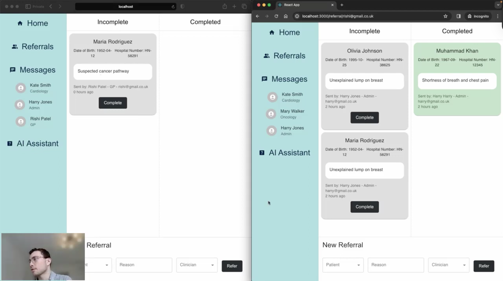

# Referral App

A web platform for medical professionals to chat, send and manage referrals, and consult an AI assistant. Built with **Django** (backend) and **React** (frontend).

---

## Demo

[](https://www.youtube.com/watch?v=ohKTMvp8NQs)



---

## Features
- Secure user authentication
- Real-time chat between medical professionals
- Create, send, receive, and complete patient referrals
- AI assistant for support and queries
- User roles (Admin, GP, Specialist, etc.)

---

## Setup Instructions

### Backend (Django)
1. **Navigate to the backend directory:**
   ```bash
   cd chat_app_backend/backend
   ```
2. **Create a virtual environment:**
   ```bash
   conda create --name <env_name> --file environment.yml
   ```
3. **Activate the virtual environment:**
   ```bash
   conda activate <env_name>
   ```
4. **Install dependencies:**
   ```bash
   pip install -r requirements.txt
   ```
5. **Run migrations:**
   ```bash
   python manage.py makemigrations
   python manage.py migrate
   ```
6. **Start the Django development server:**
   ```bash
   python manage.py runserver
   ```

### Frontend (React)
1. **Navigate to the frontend directory:**
   ```bash
   cd chat_app_frontend/frontend
   ```
2. **Install dependencies:**
   ```bash
   npm install
   ```
3. **Start the React development server:**
   ```bash
   npm start
   ```

---

## Usage
- **Backend Django Admin:** [http://127.0.0.1:8000/](http://127.0.0.1:8000/)
- **Frontend React Client:** [http://localhost:3000/](http://localhost:3000/)

---

## License

This project is licensed under the MIT License.